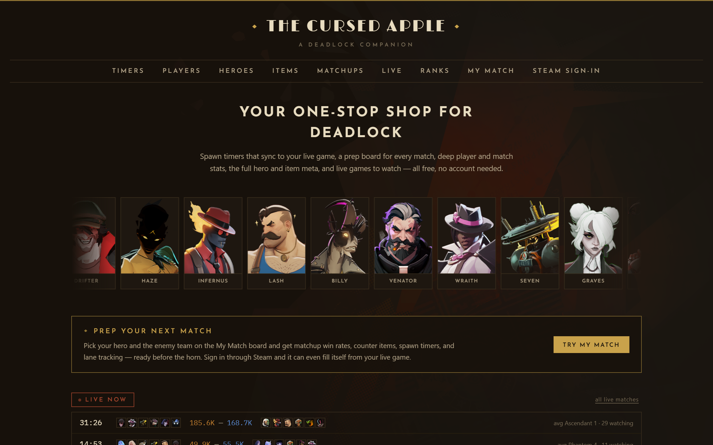
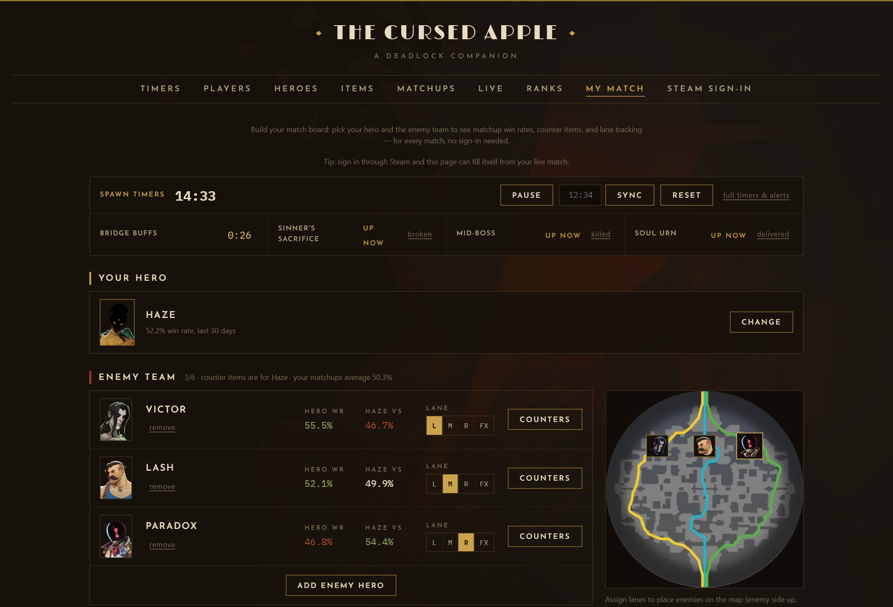

# The Cursed Apple — a Deadlock companion

**Live at [deadlock-companion.pages.dev](https://deadlock-companion.pages.dev)**

Spawn timers, match prep, player stats, hero and item meta, leaderboards, and live
matches for Valve's Deadlock — in a 1930s-noir dress. Free, no account needed.



## Features

- **Spawn timers** — a match clock you sync once (or auto-sync from your live match),
  with countdowns for camps, boxes & golden statues, bridge buffs, Sinner's Sacrifice,
  the Mid-Boss ladder, and the Soul Urn — plus an objective map, spawn alerts, and a
  cheat sheet.
- **My Match** — a prep board for every game: pick your hero and the enemy team for
  matchup win rates, data-driven counter items, lane tracking on a minimap, and a
  compact spawn-timer strip. Signed in, it fills itself from your live match with
  player names and ranks.
- **Player profiles** — find anyone by Steam link, ID, or name: win rate, KDA,
  favorite and best heroes, favorite items, rank badges, and a match history
  filterable by hero and date.
- **Match breakdowns** — team scoreboards, the souls race over time, every player's
  item build with hover details and buy times, and the Mid-Boss log.
- **Heroes** — lore, abilities with rank buffs, base stats and weapon data, 30-day
  win rates, and the most popular items per tier for all heroes.
- **Items** — every shop item with what it does, usage and win rates, and pick rate
  per hero; hovering an item anywhere shows its details.
- **Matchups & counters** — how a hero fares into every opponent, why the matchup
  leans that way (souls, kill trades, denies, objective pressure), and the items that
  actually win those games.
- **Ranks** — regional top-1000 leaderboards with player search and find-me, and the
  full rank distribution with your percentile when signed in.
- **Live matches** — ongoing games with live soul counts and average ranks, a watch
  link into Deadlock, and one-click spawn-timer sync.
- **Steam sign-in** — optional OpenID login (via Cloudflare Pages Functions) that
  unlocks the self-filling My Match board, your profile, and your spot on the rank
  distribution. No password ever touches this app.



Stats come from the community [Deadlock API](https://deadlock-api.com); game art is
served from its assets service.

## Development

```sh
npm install
npm run dev      # dev server (UI only; auth endpoints 404 and read as signed out)
npm run dev:cf   # dev server behind wrangler, with the auth functions running
npm test         # vitest
npm run lint     # eslint
npm run build    # type-check + production build
```

For `dev:cf`, copy `.dev.vars.example` to `.dev.vars` first.

## Timing data

Objective timings live in [`src/data/timers.json`](src/data/timers.json), stamped with the
patch they were verified against. Valve moves these numbers regularly — if a patch changes
a timer, that file is the only thing to update.

## Deployment

Deployed on Cloudflare Pages. Build command `npm run build`, output directory `dist`.
Steam sign-in requires a `SESSION_SECRET` environment variable on the Pages project
(Settings → Variables and Secrets → add as **Secret**): any long random string, e.g.
the output of `openssl rand -hex 32` or PowerShell
`-join ((1..64) | % { '{0:x}' -f (Get-Random -Max 16) })`.
